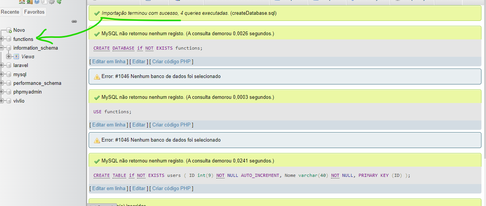

# Como usar

Como neste exercício eu utilizei o mySQL, você precisará implementar o Banco de Dados que estou usando no seu mySQL.

## Como executar?

1. Após abrir o XAMPP, ligue o mySQL
2. Abra o <a href="localhost/phpmyadmin">localhost/phpmyadmin</a>
(Ou clique no botão "Admin", ao lado de MySQL, no XAMPP)

3. Clique em "Importar"
    
4. Clique em "Escolher Arquivo"
    
    Escolha o arquivo `createDatabase.sql`, localizado em `nome-do-projeto/secoes/sec01/ex18/public/createDatabase.sql`
5. Vá para baixo da página e clique no botão "Importar"
    

Caso sua tela fique como essa imagem, deu certo!
    

`Caso não deu certo, verifique se você já possui algum database com o nome 'functions' `